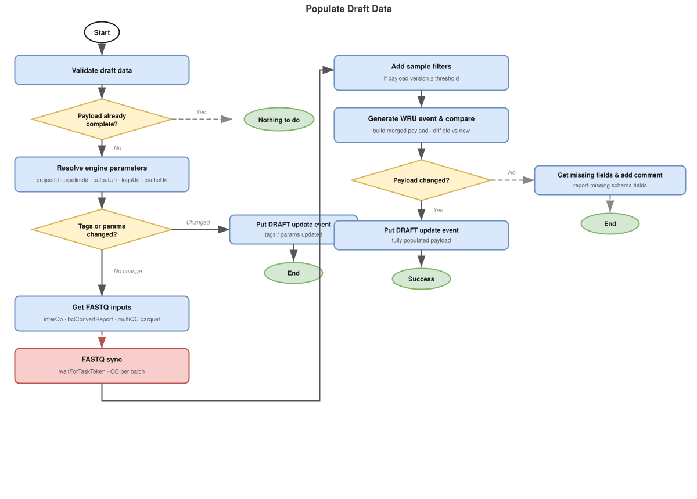
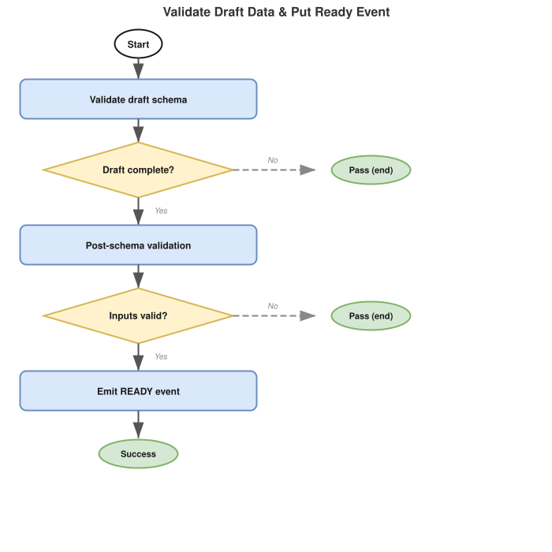
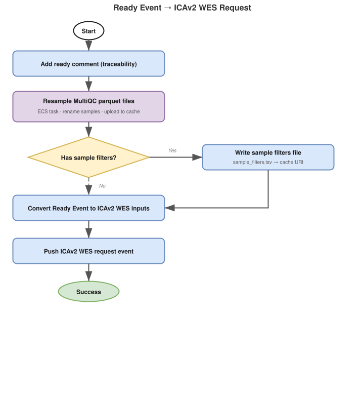
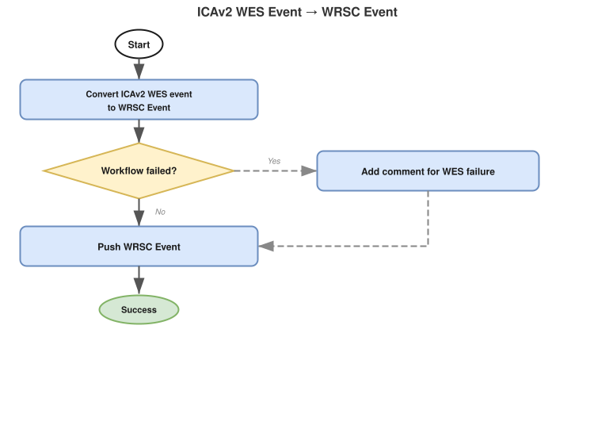

# BCLConvert InterOp QC Pipeline Manager

- [Overview](#overview)
- [Pipeline State Flow](#pipeline-state-flow)
  - [1. DRAFT → populated DRAFT](#1-draft--populated-draft)
  - [2. Populated DRAFT → READY](#2-populated-draft--ready)
  - [3. READY → ICAv2 submission](#3-ready--icav2-submission)
  - [4. ICAv2 state changes → WorkflowRunUpdate events](#4-icav2-state-changes--workflowrunupdate-events)
- [Event Contract](#event-contract)
  - [Consumed Events](#consumed-events)
  - [Published Events](#published-events)
- [Draft Event Payload](#draft-event-payload)
  - [Minimal DRAFT event detail](#minimal-draft-event-detail)
  - [Auto-populated Fields](#auto-populated-fields)
  - [Schema Validation](#schema-validation)
- [Submitting a Draft Event](#submitting-a-draft-event)
- [Infrastructure](#infrastructure)
  - [Stateful Resources](#stateful-resources)
  - [Stateless Resources](#stateless-resources)
  - [Stacks](#stacks)
- [CI/CD and Release Management](#cicd-and-release-management)
- [Related Services](#related-services)
- [SOPs](#sops)
- [Glossary & References](#glossary--references)

---

## Overview

This service manages the lifecycle of the **BCLConvert InterOp QC pipeline** — a quality control pipeline that evaluates sequencing run quality by analysing BCLConvert demultiplexing metrics and Illumina InterOp data.

The pipeline runs on [ICAv2](https://help.ica.illumina.com/) via CWL. See the [CWL releases](https://github.com/umccr/cwl-ica/releases?q=bclconvert-interop-qc&expanded=true) for versioned workflow definitions. Orchestration follows the standard [ICAv2-centric Pipeline Architecture](https://github.com/OrcaBus/wiki/blob/main/orcabus/platform/pipelines.md#pipeline-orchestration-general-logic).

This is a **non-downstream (top-level) service** — it has no upstream pipeline dependencies and is triggered directly by sequencing run events. It collects MultiQC parquet files from FASTQ data associated with an instrument run, resamples them via an ECS task, and submits the QC pipeline to ICAv2.

**Upstream**: None (triggered directly by sequencing run events via Analysis Glue)
**Downstream**: None
**Key dependencies**: [ICAv2 WES Manager](https://github.com/OrcaBus/service-icav2-wes-manager), [Workflow Manager](https://github.com/OrcaBus/service-workflow-manager), [Fastq Manager](https://github.com/OrcaBus/service-fastq-manager)

---

## Pipeline State Flow

The service orchestrates four Step Functions state machines that together drive a workflow run from initial DRAFT submission through to ICAv2 execution and result reporting.

### 1. DRAFT → populated DRAFT

**State machine**: [`populate_draft_data_sfn_template`](app/step-functions-templates/populate_draft_data_sfn_template.asl.json)



When a `WorkflowRunStateChange` DRAFT event arrives, this state machine populates any missing payload fields by resolving defaults from SSM and querying upstream services:

1. **Early exit check** — validates whether the existing `data` payload already satisfies the complete-data schema. If it does, no further population is needed and the state machine exits.
2. **Resolve engine parameters** (in parallel):
   - `projectId` — uses the provided value or fetches the environment default from SSM
   - `pipelineId` — uses the provided value, the event's `executionEnginePipelineId`, or looks up the default for the workflow version from SSM
   - `outputUri` — uses the provided value or builds a path from the SSM output prefix + `portalRunId`
   - `logsUri` — same pattern as `outputUri`
3. **Resolve tags** — populates `instrumentRunId` and related metadata from the linked libraries.
4. **Emit a DRAFT update event** if tags or engine parameters changed (so the Workflow Manager record is kept in sync), then continue.
5. **Resolve inputs** — discovers all FASTQ IDs in the instrument run, collects/generates MultiQC parquet files, resamples them via an ECS task, and writes sample filter files.
6. Emits a final DRAFT update event with the fully populated payload.

### 2. Populated DRAFT → READY

**State machine**: [`validate_draft_data_and_put_ready_event_sfn_template`](app/step-functions-templates/validate_draft_data_and_put_ready_event_sfn_template.asl.json)



Triggered when a DRAFT `WorkflowRunStateChange` event is received with a fully populated payload:

1. **Schema validation** — invokes the `validate_draft_data_complete_schema` Lambda against the registered AWS Schemas registry entry. On failure, a comment is written back to the workflow run record and the state machine exits silently.
2. **Post-schema validation** — invokes business-rule checks beyond what JSON Schema can express. On failure, same comment-and-exit behaviour.
3. **Push READY event** — emits a `WorkflowRunStateChange` READY event to the `OrcaBusMain` EventBridge bus.

### 3. READY → ICAv2 submission

**State machine**: [`ready_event_to_icav2_wes_request_event_sfn_template`](app/step-functions-templates/ready_event_to_icav2_wes_request_event_sfn_template.asl.json)



Converts a READY event into an `Icav2WesRequest` event that the [ICAv2 WES Manager](https://github.com/OrcaBus/service-icav2-wes-manager) consumes to launch the CWL analysis on ICAv2:

1. **Convert** — the `bclconvert_interopqc_ready_to_icav2_wes_request` Lambda translates the READY event payload into the ICAv2 WES request format.
2. **Push** — emits an `Icav2WesRequest` event to `OrcaBusMain`.

### 4. ICAv2 state changes → WorkflowRunUpdate events

**State machine**: [`icav2_wes_event_to_wrsc_event_sfn_template`](app/step-functions-templates/icav2_wes_event_to_wrsc_event_sfn_template.asl.json)



Listens for `Icav2WesAnalysisStateChange` events and converts them into `WorkflowRunUpdate` events:

1. **Convert** — the `convert_icav2_wes_state_change_event_to_wrsc_event` Lambda maps the ICAv2 status to a `WorkflowRunStateChange` event.
2. **Route by status**:
   - **SUCCEEDED** — pushes the WRSC event.
   - **FAILED** — invokes the failure comment Lambda to write a failure comment to the workflow run record, then pushes the WRSC event.
   - **Any other status** — pushes the WRSC event directly.

---

## Event Contract

### Consumed Events

| DetailType                    | Source                    | Schema                                                                                                                                     | Description                                          |
|-------------------------------|---------------------------|--------------------------------------------------------------------------------------------------------------------------------------------|------------------------------------------------------|
| `WorkflowRunStateChange`      | `orcabus.workflowmanager` | [WorkflowRunStateChange](https://github.com/OrcaBus/wiki/tree/main/orcabus-platform#workflowrunstatechange)                                | Carries DRAFT (and later READY) workflow run records |
| `Icav2WesAnalysisStateChange` | `orcabus.icav2wes`        | [Icav2WesAnalysisStateChange](https://github.com/OrcaBus/service-icav2-wes-manager/blob/main/app/event-schemas/analysis-state-change.json) | ICAv2 analysis state updates                         |

### Published Events

| DetailType          | Source                            | Schema                                                                                                      | Description                                         |
|---------------------|-----------------------------------|-------------------------------------------------------------------------------------------------------------|-----------------------------------------------------|
| `WorkflowRunUpdate` | `orcabus.bclconvertinteropqc`     | [WorkflowRunUpdate](https://github.com/OrcaBus/wiki/blob/main/orcabus/platform/events.md#workflowrunupdate) | Pipeline state updates (READY, running, succeeded…) |

---

## Draft Event Payload

A DRAFT event can be submitted with a minimal `data` payload — the populate state machine resolves all defaults. The `data` object may be omitted entirely. The final validated payload must satisfy the [complete-data draft schema](app/event-schemas/complete-data-draft/).

The key driver is the `instrumentRunId` — this determines which FASTQ data to collect QC metrics for.

### Minimal DRAFT event detail

```json
{
  "status": "DRAFT",
  "workflowName": "bclconvert-interop-qc",
  "workflowVersion": "2025.05.29",
  "workflowRunName": "umccr--automated--bclconvert-interop-qc--2025-05-29--<portalRunId>",
  "portalRunId": "<portalRunId>",
  "linkedLibraries": [
    { "libraryId": "L2300950", "orcabusId": "lib.01..." }
  ]
}
```

The `payload.data` object may be included to override any auto-populated fields (see table below). An empty or absent `payload.data` is valid.

### Auto-populated Fields

All of the following are resolved by the populate state machine if not explicitly provided:

| Field | Resolved from |
|---|---|
| `engineParameters.projectId` | SSM: default ICAv2 project for the environment |
| `engineParameters.pipelineId` | SSM: pipeline ID map keyed by workflow version |
| `engineParameters.outputUri` | SSM: output prefix + `portalRunId` |
| `engineParameters.logsUri` | SSM: logs prefix + `portalRunId` |
| `tags.instrumentRunId` | From linked libraries metadata |
| `inputs.instrumentRunId` | From tags |
| `inputs.sampleFilters` | Generated from FASTQ IDs in the instrument run |
| `inputs.cacheUri` | Built from SSM cache prefix + `portalRunId` |

### Schema Validation

The complete-data schema is registered in the AWS Schemas registry and used for validation in both state machines. You can interactively validate a payload at:

- [JSON Schema Validator — Complete DRAFT data](https://www.jsonschemavalidator.net/s/gRdv0Lad)

---

## Submitting a Draft Event

To manually submit a BCLConvert InterOp QC DRAFT event (e.g. to trigger a reanalysis), follow:

- [PM.BIQ.1 — Manual Pipeline Execution](docs/operation/SOP/PM.BIQ.1/PM.BIQ.1-ManualPipelineExecution.md)

See the [full SOPs index](docs/operation/SOP/README.md) for all operational procedures including deployment, parameter updates, and troubleshooting.

---

## Infrastructure

The service is deployed via AWS CDK. Resources are split into two stacks: stateful (data/config) and stateless (compute/events).

All SSM parameters live under `/orcabus/workflows/bclconvert-interop-qc/`.
Event bus: `OrcaBusMain`
Event source: `orcabus.bclconvertinteropqc`

### Stateful Resources

**AWS Schemas registry**
- `bclconvert-interop-qc-complete-data-draft-schema` — used to validate DRAFT payloads before promotion to READY

**SSM Parameters**

| Parameter | Description |
|---|---|
| `workflowName` | `bclconvert-interop-qc` |
| `workflowVersion` | Current default version |
| `payloadVersion` | Payload schema version |
| `icav2ProjectId` | Default ICAv2 project ID per environment |
| `logsPrefix` | Default S3 prefix for logs |
| `outputPrefix` | Default S3 prefix for outputs |
| `pipelineIdsByWorkflowVersion/<version>` | ICAv2 CWL pipeline ID for each workflow version |

### Stateless Resources

- **Lambda functions** (Python 3.14, ARM64) — one per task in the state machines; see [`app/lambdas/`](app/lambdas/)
- **ECS Fargate task** — resamples MultiQC parquet files for input into the pipeline
- **Step Functions state machines** — four ASL templates in [`app/step-functions-templates/`](app/step-functions-templates/)
- **EventBridge rules** — route incoming `WorkflowRunStateChange` (DRAFT) and `Icav2WesAnalysisStateChange` events to the appropriate state machines

### Stacks

The CDK project deploys a CodePipeline in the toolchain account that promotes changes to `beta`, `gamma`, and `prod`.

```sh
# List stateful stacks
pnpm cdk-stateful ls
# StatefulBclConvertInteropQc
# StatefulBclConvertInteropQc/.../OrcaBusBeta/OrcaBus-BclconvertInteropQc-StatefulMicroservice
# StatefulBclConvertInteropQc/.../OrcaBusGamma/OrcaBus-BclconvertInteropQc-StatefulMicroservice
# StatefulBclConvertInteropQc/.../OrcaBusProd/OrcaBus-BclconvertInteropQc-StatefulMicroservice

# List stateless stacks
pnpm cdk-stateless ls
# StatelessBclConvertInteropQc
# StatelessBclConvertInteropQc/.../OrcaBusBeta/OrcaBus-BclconvertInteropQc-StatelessMicroservice
# StatelessBclConvertInteropQc/.../OrcaBusGamma/OrcaBus-BclconvertInteropQc-StatelessMicroservice
# StatelessBclConvertInteropQc/.../OrcaBusProd/OrcaBus-BclconvertInteropQc-StatelessMicroservice
```

---

## CI/CD and Release Management

All changes merged to `main` are automatically built and deployed to `beta` and `gamma`. Promotion to `prod` requires manually enabling the CodePipeline transition in the AWS console.

---

## Related Services

| Role            | Service                                                                               |
|-----------------|---------------------------------------------------------------------------------------|
| Upstream trigger| [Analysis Glue](https://github.com/OrcaBus/service-analysis-glue)                     |
| ICAv2 execution | [ICAv2 WES Manager](https://github.com/OrcaBus/service-icav2-wes-manager)             |
| Workflow state  | [Workflow Manager](https://github.com/OrcaBus/service-workflow-manager)               |
| Fastq data      | [Fastq Manager](https://github.com/OrcaBus/service-fastq-manager)                    |

---

## SOPs

| SOP | Description |
|---|---|
| [PM.BIQ.1](docs/operation/SOP/PM.BIQ.1/PM.BIQ.1-ManualPipelineExecution.md) | Manually kick off a reanalysis |
| [PM.BIQ.2](docs/operation/SOP/PM.BIQ.2/PM.BIQ.2-NewPipelineDeployment.md) | Install and deploy a new pipeline version |
| [PM.BIQ.3](docs/operation/SOP/PM.BIQ.3/PM.BIQ.3-UpdatingPipelineParameters.md) | Update SSM parameters |
| [PM.BIQ.4](docs/operation/SOP/PM.BIQ.4/PM.BIQ.4-RunningWorkflowValidations.md) | Run workflow validations |
| [PM.BIQ.5](docs/operation/SOP/PM.BIQ.5/PM.BIQ.5-TroubleShooting.md) | Troubleshoot common issues |

---

## Glossary & References

- Platform glossary: [OrcaBus wiki](https://github.com/OrcaBus/wiki/blob/main/orcabus-platform/README.md#glossary--references)
- For development setup, build commands, project structure, and conventions see the [steering docs](.kiro/steering/).
